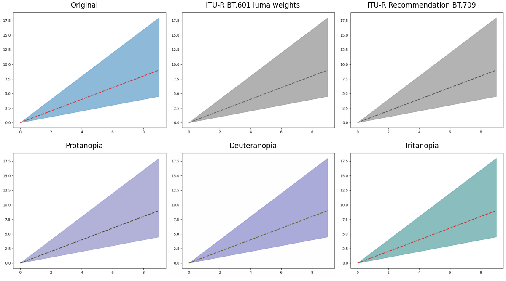

# Diagfig
A reviewer asked you for a b/w & colourblind friendly figure? `diagfig` can be used for a very simple visual checking.

Other solutions exist for checking in a palette or an image is colourblind friendly, but I needed a tool that I could more easily plug on `matplotlib` that would check in one line a figure. The code is vaslty inspired by other solutions but avoid too many dependencies.

## Install the package

```bash
pip install diagfig
```

## Example of use
The following example provide a few possibilities of use of `diagfig`. Similar to example_1.py.

```python
import numpy as np
import matplotlib.pyplot as plt
import diagfig

# creating a dummy figure in matplotlib
fig, ax = plt.subplots()
x = np.arange(10)
y_low = x * .5
y_high = x * 2
y = x.copy()
ax.fill_between(x, y_low, y_high, color="tab:blue", alpha=.5)
ax.plot(x, y, color="tab:red", lw=2, ls="--")

# diagnosing the figure
fig_diag = diagfig.diagnose_figure(fig)
```

A decorator `@diag_it` is also available in `diagfig`. Similar to example_2.py.
```python
import numpy as np
import matplotlib.pyplot as plt
from diagfig import diag_it

# creating a dummy figure in matplotlib
@diag_it
def simple_plot()-> plt.Figure:
    fig, ax = plt.subplots()
    x = np.arange(10)
    y_low = x * .5
    y_high = x * 2
    y = x.copy()
    ax.fill_between(x, y_low, y_high, color="tab:blue", alpha=.5)
    ax.plot(x, y, color="tab:red", lw=2, ls="--")
    return fig

# diagnosing the figure
simple_plot()
```

It is also possible to initiate `matplotlib` figures with the custom subclass `FigureDiag`

```python
import numpy as np
import matplotlib.pyplot as plt
from diagfig import FigureDiag

# creating a dummy figure in matplotlib using the custom subclass of matplotlib.figure.Figure
fig, ax = plt.subplots(FigureClass=FigureDiag)
x = np.arange(10)
y_low = x * .5
y_high = x * 2
y = x.copy()
ax.fill_between(x, y_low, y_high, color="tab:blue", alpha=.5)
ax.plot(x, y, color="tab:red", lw=2, ls="--")

# diagnosing the figure
diaged_fig = fig.diag()
```
### Output generated:



### Disclaimer

This is by no mean my field of research, I took it as an exercise to produce a python package.